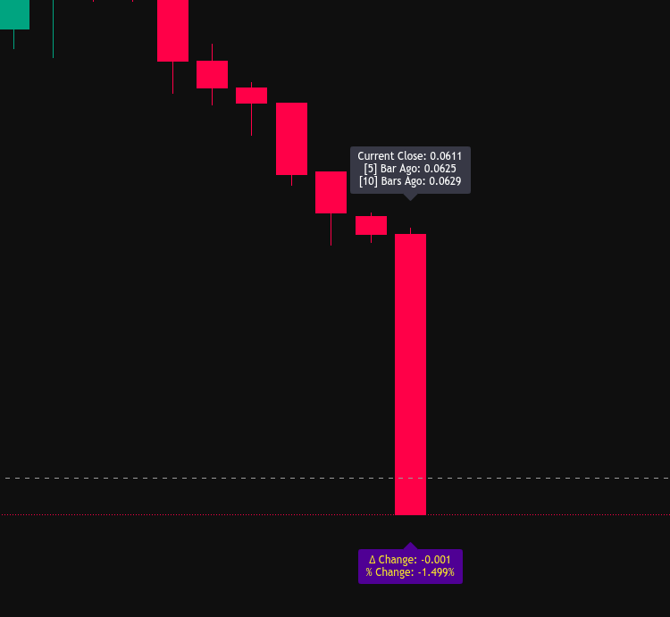

## Intro

- [Intro](#intro)
  - [Price Series vs Indicator Series in Pine Script](#price-series-vs-indicator-series-in-pine-script)
    - [Price Series](#price-series)
    - [Historical Data Access `[]`](#historical-data-access-)
  - [Indicator Series](#indicator-series)
- [Data Types and Variable](#data-types-and-variable)
  - [The Two Parts of a Type](#the-two-parts-of-a-type)
  - [Declaration Keywords](#declaration-keywords)
  - [Declaration Syntax Examples](#declaration-syntax-examples)
    - [Dynamic (Re-calculates every bar)](#dynamic-re-calculates-every-bar)
    - [Persistent (Stored across bars)](#persistent-stored-across-bars)
    - [Re-assigning Values (`:=`)](#re-assigning-values-)
  - [4. Inputs (User Settings)](#4-inputs-user-settings)

### Price Series vs Indicator Series in Pine Script


####  Price Series

In Pine Script, a **Series** is the fundamental data structure. Unlike a single variable in traditional programming that holds one value at a time, a series is like a continuous array that grows with every new price bar. 

Pine Script provides several built-in series variables that represent the OHLCV (Open, High, Low, Close, Volume) data.

* **`open`, `high`, `low`, `close`**: The standard price points of a bar.
* **`volume`**: The amount of asset traded during that bar.
* **Calculated Series**: Built-in shortcuts for common averages:
    * **`hl2`**: $\frac{high + low}{2}$
    * **`hlc3`**: $\frac{high + low + close}{3}$
    * **`ohlc4`**: $\frac{open + high + low + close}{4}$

When you reference `close`, you aren't just getting a number; you are accessing the entire history of closing prices for that asset.

Example:

```cpp
// ═════════════════════════════════════════════════════════════════════════════
// PRICE SERIES - Built-in OHLCV (always available)
// ═════════════════════════════════════════════════════════════════════════════
openPriceSeries   = open      // Current bar's open
highPriceSeries   = high      // Current bar's high
lowPriceSeries    = low       // Current bar's low
closePriceSeries  = close     // Current bar's close
volumePriceSeries = volume    // Trading volume
hl2PriceSeries    = hl2       // (high + low) / 2
hlc3PriceSeries   = hlc3      // (high + low + close) / 3
ohlc4PriceSeries  = ohlc4     // (open + high + low + close) / 4

// ═════════════════════════════════════════════════════════════════════════════
// PLOT PRICE SERIES (Visual Log)
// ═════════════════════════════════════════════════════════════════════════════
plot(openPriceSeries,   color = color.olive,     title = "Open")
plot(highPriceSeries,   color = color.maroon,   title = "High")
plot(lowPriceSeries,    color = color.blue,    title = "Low")
plot(closePriceSeries,  color = color.orange,  title = "Close")  // Thicker

// Plot derived price series
plot(hl2PriceSeries,    color = color.purple,  title = "HL2")
plot(hlc3PriceSeries,   color = color.gray,    title = "HLC3")
plot(ohlc4PriceSeries,  color = color.teal,    title = "OHLC4")
```


#### Historical Data Access `[]`

```text
Chart Direction:  PAST ←——————————————————---- CURRENT
Index Values:     [100] [50] [10] [5] [2] [1] [0]
                  older  →  →  →  →  →  →  newer
```

Syntax Reference

```cpp
// Current bar (these are equivalent)
currentClose = close
alsoCurrent  = close[0]

// Previous bars
prevClose    = close[1]   // 1 bar ago
close5ago    = close[5]   // 5 bars ago
close20ago   = close[20]  // 20 bars ago

// With offset in variable
length = 10
closeNago = close[length] // Dynamic offset
```

Example Usage:

```cpp
// Access previous bar values
close5BarsAgo = close[5]
close10BarsAgo = close[10]

// Compare current vs historical
priceChange   = close - close[1]           // Absolute change
percentChange = (close / close[1] - 1) * 100  // Percentage change

// Plotting
// 1. Initialize the label variables once (this runs only on the first bar)
var label closeLabel   = na
var label changeLabel = na
float offset = ta.atr(14) * 0.25

if barstate.islast
    // 2. If the labels don't exist yet, create them
    if na(closeLabel)
        closeLabel   := label.new(bar_index, high + offset, "", color = color.black, textcolor = color.white, style = label.style_label_down)
        changeLabel := label.new(bar_index, low - offset,  "", color = color.navy,  textcolor = color.yellow, style = label.style_label_up)
        // label.new(x, y, text, xloc, yloc, color, style, textcolor, size, textalign, tooltip, text_font_family, force_overlay, text_formatting)


    // 3. Update the text and move them to the latest bar (bar_index)
    label.set_xy(closeLabel, bar_index, high + offset)
    label.set_text(closeLabel, 
         "Current Close: " + str.tostring(close, "#.####") + 
         "\n[5] Bar Ago: " + str.tostring(close5BarsAgo, "#.####") + 
         "\n[10] Bars Ago: " + str.tostring(close10BarsAgo, "#.####"))

    label.set_xy(changeLabel, bar_index, low - offset)
    label.set_text(changeLabel, 
         "Δ Change: " + str.tostring(priceChange, "#.###") + 
         "\n% Change: " + str.tostring(percentChange, "#.###") + "%")
```


<p align="center">

</p>


Common Historical Patterns


```cpp
//@version=6
indicator("Historical Patterns", overlay = true)

// Price change calculations
priceChange   = close - close[1]                                                            // Absolute change
percentChange = (close / close[1] - 1) * 100                                                // Percentage change
trueRange     = math.max(high - low, math.abs(high - close[1]), math.abs(low - close[1]))   // True range


// Trend detection
higherHigh = high > high[1] and high[1] > high[2]  // 3-bar higher high
lowerLow   = low < low[1] and low[1] < low[2]      // 3-bar lower low

// Bar comparison
bullishBar = close > open          // Current bar bullish
prevBullish = close[1] > open[1]   // Previous bar bullish
twoBullish = bullishBar and prevBullish  // Two in a row

// Gap detection
gapUp   = low > high[1]            // Gap up (current low > previous high)
gapDown = high < low[1]            // Gap down (current high < previous low)
```


### Indicator Series

In Pine Script, technical indicators like **SMA**, **RSI**, or **MACD** are not just single numbers; they are **Series**. This means that for every bar on your chart, the indicator has a corresponding value. Just like price data (`close`), you can look back at historical indicator values using the `[]` operator.

1. **Moving Average Series (Trend)**
   
Moving averages smooth out price action to identify the trend. While they all follow price, they react with different speeds (latency).

* **`ta.sma(source, length)`**: Simple arithmetic mean. The smoothest but slowest.
* **`ta.ema(source, length)`**: Gives more weight to recent prices. Reacts faster to price changes.
* **`ta.hma(source, length)`**: Designed to reduce lag significantly while remaining smooth.
* **`ta.vwma(source, length)`**: Weights price by volume, showing where the "heavy" trading occurred.


1. **Multi-Variable Outputs (Tuples)**
   
Some indicators, like **MACD** and **Bollinger Bands**, return multiple series at once. In Pine Script, we use **Tuples** (brackets `[]`) to capture all the lines generated by a single function.

```cpp
// MACD returns three distinct series: The Line, the Signal, and the Histogram
[macdLine, signalLine, macdHist] = ta.macd(close, 12, 26, 9)

// Bollinger Bands return the Middle (Basis), Upper, and Lower bands
[basis, upper, lower] = ta.bb(close, 20, 2)
```

 3. **Oscillators and Volatility**

These indicators usually move within a specific range (like 0–100) or measure the "stretch" of the market.

* **`ta.rsi(source, length)`**: Measures the speed and change of price movements. 
* **`ta.atr(length)`**: Measures volatility by looking at the average range of bars (including gaps).
* **`ta.stoch(source, high, low, length)`**: Compares a closing price to its price range over a given period.

 4. Indicator History & Logic

Because indicators are series, you can perform calculations on the indicator itself. This is how most "Divergence" or "Cross" logic is built.

Examples of Indicator-on-Indicator Logic:

```cpp
// 1. Cross Detection
rsiCrossUp = ta.crossover(rsi, 30)   // Returns true if RSI crossed above 30 this bar

// 2. Momentum of an Indicator
rsiSlope = rsi - rsi[5]              // Is the RSI rising or falling compared to 5 bars ago?

// 3. Smoothing an Indicator
smoothedRSI = ta.sma(rsi, 10)        // Taking the SMA of an RSI series
```


## Data Types and Variable


### The Two Parts of a Type

Every variable in Pine has a **Type** (what it is) and a **Form** (how it changes).

- **Types:** `int` (1, 2), `float` (1.2), `bool` (true/false), `color`, `string`, `line`, `label`.
- **Forms:** 
  - **`const`:** Never changes (e.g., a setting).
  - **`input`:** Set by the user in settings.
  - **`simple`:** Set once at the start of a bar.
  - **`series`:** Changes bar-by-bar (the most common).

### Declaration Keywords

There are three main ways to "create" a variable:

| Keyword     | Best For...                    | Behavior                                                            |
| :---------- | :----------------------------- | :------------------------------------------------------------------ |
| **`var`**   | Labels, Lines, Cumulative Sums | Initialized **once** on the first bar; keeps its value across bars. |
| **`varip`** | Real-time high-frequency data  | Like `var`, but updates on every **tick** (intra-bar).              |
| **(none)**  | Standard calculations          | Re-calculates from scratch on **every bar**.                        |

---

### Declaration Syntax Examples

#### Dynamic (Re-calculates every bar)

```cpp
// Pine infers the type automatically (Implicit)
myPrice = close 

// You can explicitly define the type for clarity
float myAverage = ta.sma(close, 20) 
```

#### Persistent (Stored across bars)

```cpp
// This counter starts at 0 and adds 1 on every single bar
var int barCounter = 0
barCounter += 1   
```

```cpp
var barCounter = 0
barCounter += 1

barCounter2 = 0
barCounter2 += 1

if barstate.islast
    log.info("Bar count: " + str.tostring(barCounter)+" "+ str.tostring(barCounter2)) //5807 1
```


#### Re-assigning Values (`:=`)

Use `=` for the first time you create a variable. Use `:=` if you are changing a variable that was already defined with `var`.

```cpp
var float highestClose = 0.0
if close > highestClose
    highestClose := close // Use := to update a 'var'
```

---

### 4. Inputs (User Settings)

To allow users to change values without touching the code:

```cpp
int lengthInput = input.int(14, "Lookback Period") // Syntax: input.int(defval, title, minval, maxval)
color userColor = input.color(color.red, "Indicator Color")
```

